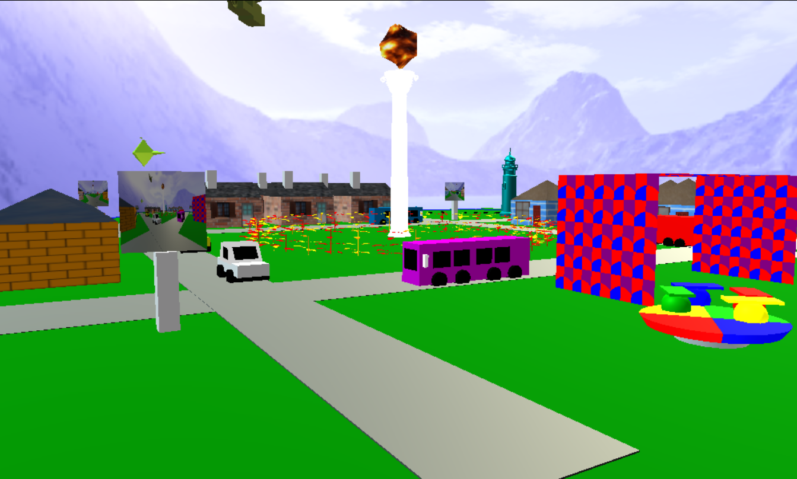

# Graphics Town - Web Application

Graphics Town functions (final project, CS559 Computer Graphics):  
https://graphics.cs.wisc.edu/WP/cs559-sp2019/2019/04/30/expectations-for-graphics-town-assignments-11-and-12/  

Attributions:  
pillar.obj, deer.obj, trees.obj, lighthouse.obj are from https://free3d.com/   
Skybox pictures come from http://www.custommapmakers.org/skyboxes.php  
Houses texture pictures come from https://www.pexels.com/search/texture/  

Did you add any texture or object files?
Texture files are in /Texture folder. Object files are in /OBJ folder. 
